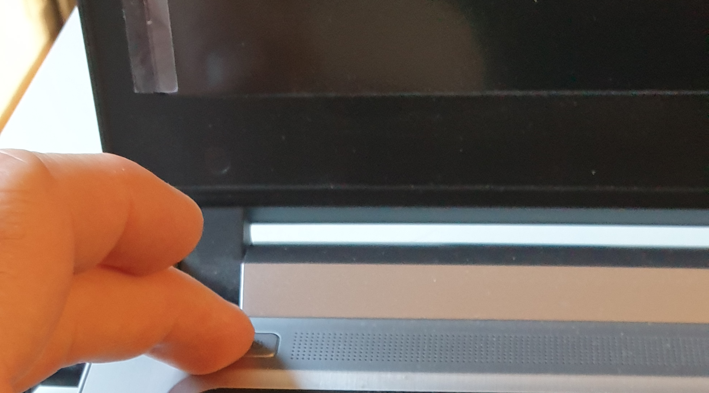

% Installation Guide
% Team Give IT / Mon 03 2022
% Well, installation will be done in 7mn without a mouse, YES!
 
# Start
{ width=250px }
 
# Start
"){ width=250px }
 
# Start
{ width=250px }
 
# Start
{ width=250px }
 
# Accept to boot on USB Key
{ width=250px }
 
# Accept to boot on USB Key
{ width=250px }
 
# Accept to boot on USB Key
{ width=250px }
 
# Accept to boot on USB Key
"){ width=250px }
 
# Accept to boot on USB Key
{ width=250px }
 
# Accept to boot on USB Key
{ width=250px }
 
# Accept to boot on USB Key
{ width=250px }
 
# Accept to boot on USB Key
{ width=250px }
 
# Start the installation
{ width=250px }
 
# Start the installation
{ width=250px }
 
# Start the installation
{ width=250px }
 
# This is the end !!! THANKS !!!
{ width=250px }
 
