% Installation Guide
% Team Give IT / Wed 07 2019
% Well, installation with a touchpad is quite painful so plug a mouse !
 
# USB Key {style="background: #DBCECC; text-align:center;"}
<!-- ---------------PAGE 1------------------------------------- -->
 
<table border="0" cellspacing="0" cellpadding="4" align="center" width="90%">
   <tr><td align="center">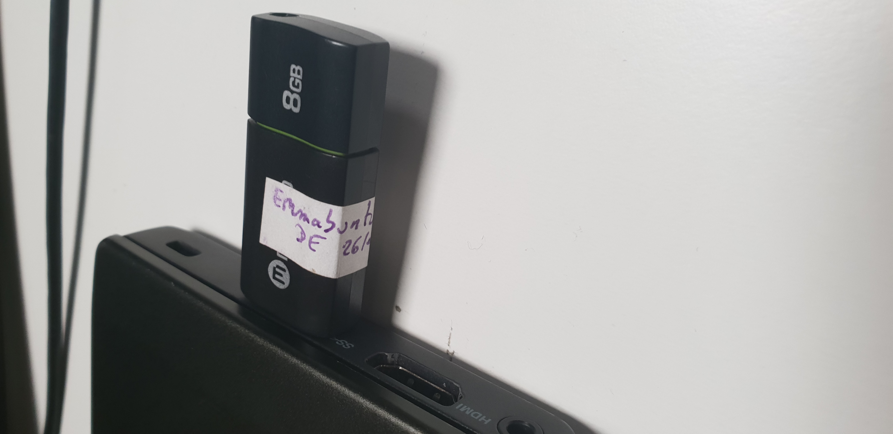</td></tr>
   <tr><td align="center">Find the USB Port</tr>
</table>
# Start the PC  {style="background: #DBCECD; text-align:center;"}
<!-- ---------------PAGE 2------------------------------------- -->
 
<table border="0" cellspacing="0" cellpadding="4" align="center" width="90%">
   <tr><td align="center">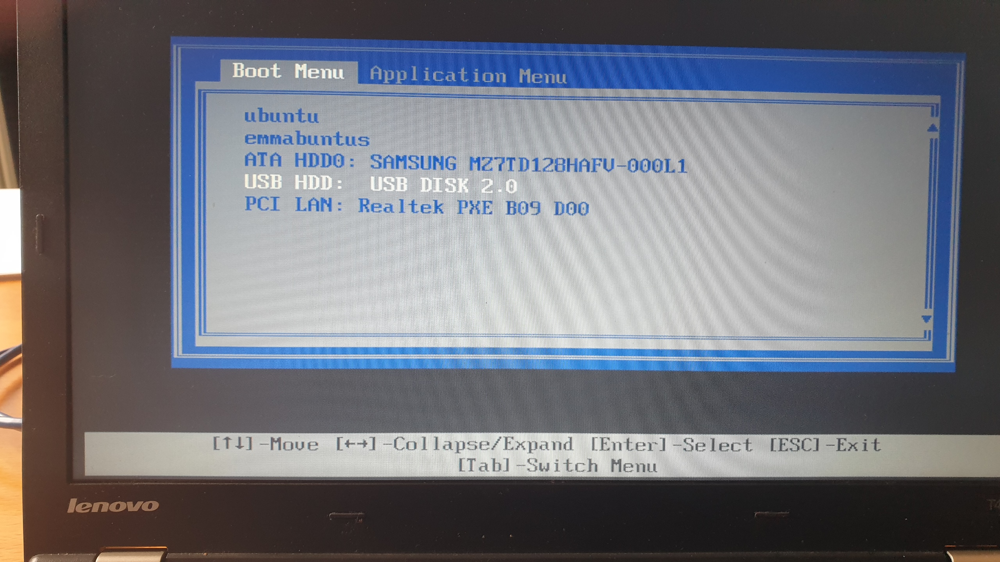</td></tr>
   <tr><td align="center">Press F12 key and identify the USB HDD line</tr>
</table>
# Distribution Start {style="background: #DBCECE; text-align:center;"}
<!-- ---------------PAGE 3------------------------------------- -->
 
<table border="0" cellspacing="0" cellpadding="4" align="center" width="90%">
   <tr><td align="center">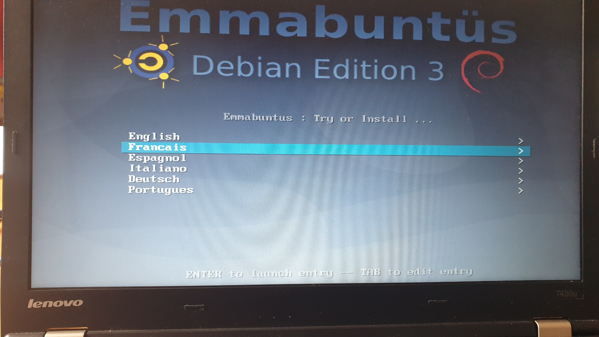</td></tr>
   <tr><td align="center">Choose French Installation</tr>
</table>
# Distribution Start {style="background: #DBCECF; text-align:center;"}
<!-- ---------------PAGE 4------------------------------------- -->
 
<table border="0" cellspacing="0" cellpadding="4" align="center" width="90%">
   <tr><td align="center">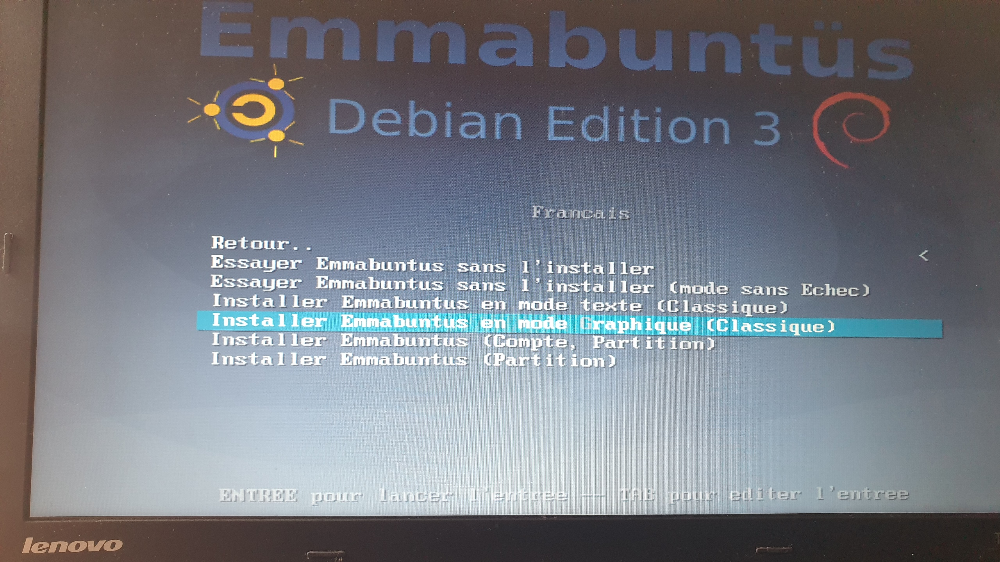</td></tr>
   <tr><td align="center">Install in graphic mode, it’s nicer</tr>
</table>
# Distribution Start {style="background: #DBCED0; text-align:center;"}
<!-- ---------------PAGE 5------------------------------------- -->
 
<table border="0" cellspacing="0" cellpadding="4" align="center" width="90%">
   <tr><td align="center">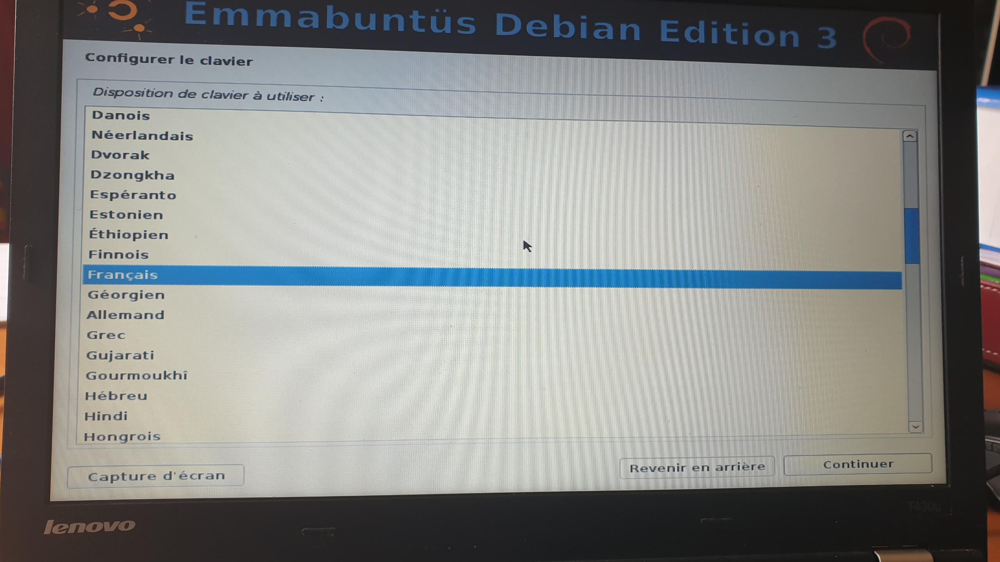</td></tr>
   <tr><td align="center">Keyboard is in the Moliere language</tr>
</table>
# Device detection {style="background: #DBCED1; text-align:center;"}
<!-- ---------------PAGE 6------------------------------------- -->
 
<table border="0" cellspacing="0" cellpadding="4" align="center" width="90%">
   <tr><td align="center">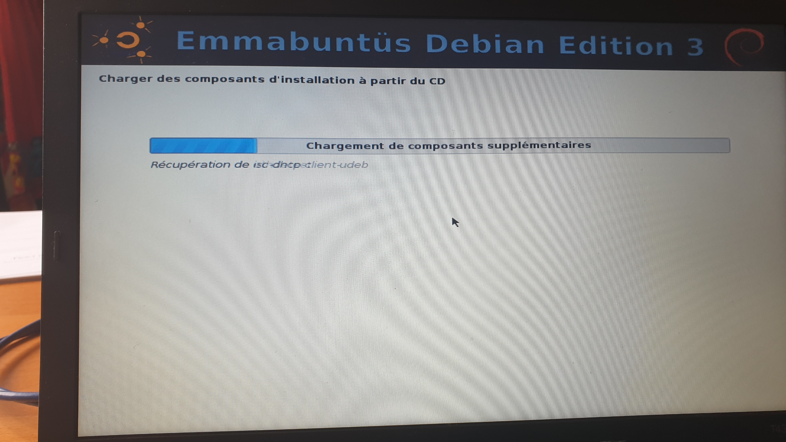</td></tr>
   <tr><td align="center">Detect devices for installation</tr>
</table>
# Network !  {style="background: #DBCED2; text-align:center;"}
<!-- ---------------PAGE 7------------------------------------- -->
 
<table border="0" cellspacing="0" cellpadding="4" align="center" width="90%">
   <tr><td align="center">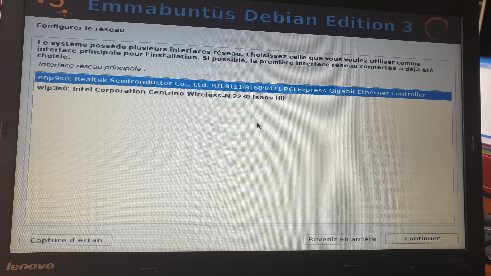</td></tr>
   <tr><td align="center">Choose Ethernet Controller (enp9s0)</tr>
</table>
# Network !  {style="background: #DBCED3; text-align:center;"}
<!-- ---------------PAGE 8------------------------------------- -->
 
<table border="0" cellspacing="0" cellpadding="4" align="center" width="90%">
   <tr><td align="center">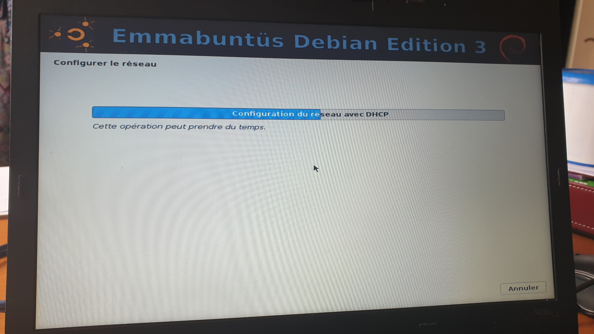</td></tr>
   <tr><td align="center">Try to configure the network</tr>
</table>
# Network !  {style="background: #DBCED4; text-align:center;"}
<!-- ---------------PAGE 9------------------------------------- -->
 
<table border="0" cellspacing="0" cellpadding="4" align="center" width="90%">
   <tr><td align="center">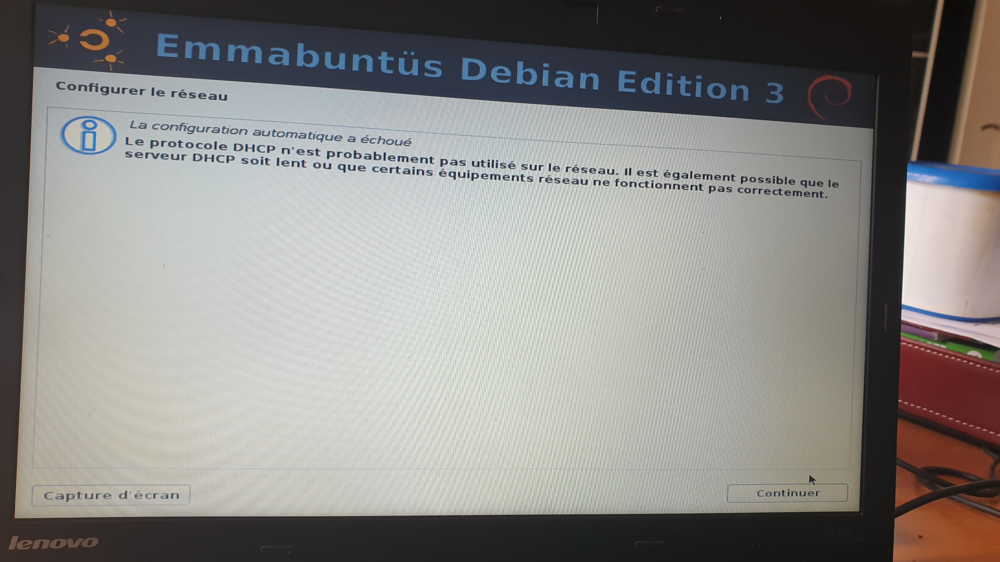</td></tr>
   <tr><td align="center">Normal error message, installation will be without network</tr>
</table>
# Network !  {style="background: #DBCED5; text-align:center;"}
<!-- ---------------PAGE 10------------------------------------- -->
 
<table border="0" cellspacing="0" cellpadding="4" align="center" width="90%">
   <tr><td align="center">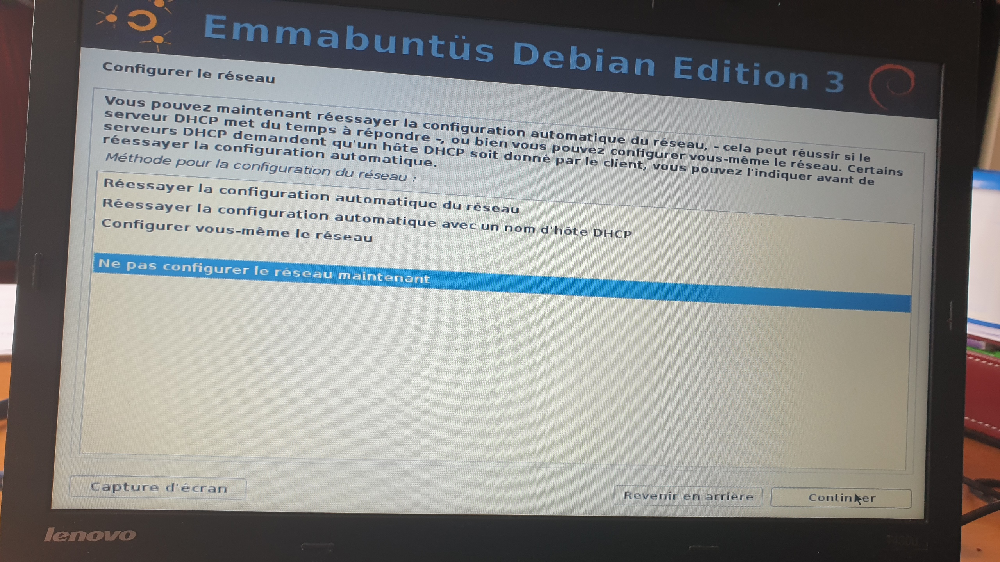</td></tr>
   <tr><td align="center">Don’t configure the network</tr>
</table>
# Naming rule {style="background: #DBCED6; text-align:center;"}
<!-- ---------------PAGE 11------------------------------------- -->
 
<table border="0" cellspacing="0" cellpadding="4" align="center" width="90%">
   <tr><td align="center"></td></tr>
   <tr><td align="center">Name the Laptop ‘LaptopX’</tr>
</table>
# Naming rule {style="background: #DBCED7; text-align:center;"}
<!-- ---------------PAGE 12------------------------------------- -->
 
<table border="0" cellspacing="0" cellpadding="4" align="center" width="90%">
   <tr><td align="center">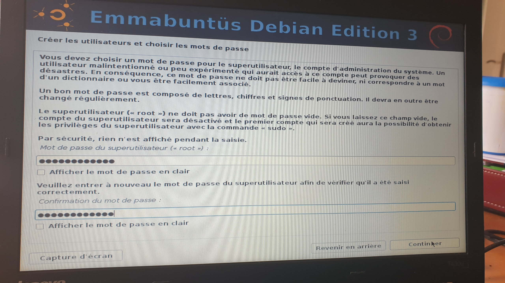</td></tr>
   <tr><td align="center">Fill the password of the SuperUser (Twice!)</tr>
</table>
# Naming rule {style="background: #DBCED8; text-align:center;"}
<!-- ---------------PAGE 13------------------------------------- -->
 
<table border="0" cellspacing="0" cellpadding="4" align="center" width="90%">
   <tr><td align="center">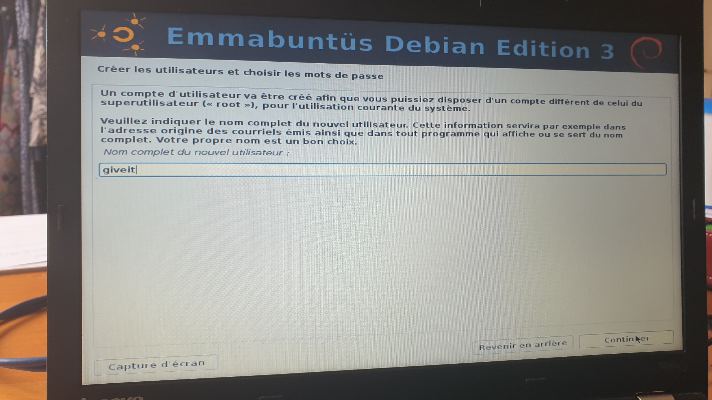</td></tr>
   <tr><td align="center">Create a user account (giveit)</tr>
</table>
# Naming rule {style="background: #DBCED9; text-align:center;"}
<!-- ---------------PAGE 14------------------------------------- -->
 
<table border="0" cellspacing="0" cellpadding="4" align="center" width="90%">
   <tr><td align="center">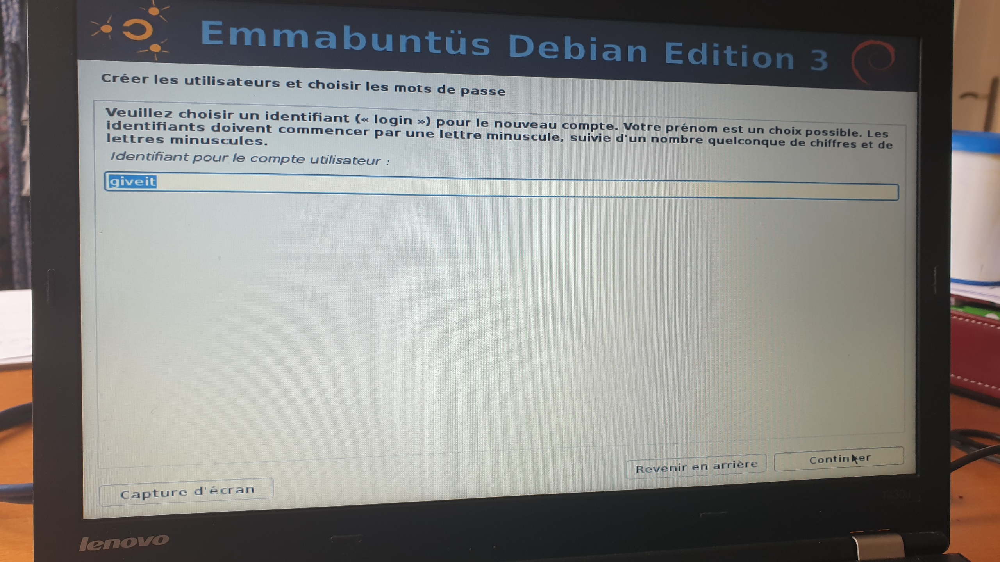</td></tr>
   <tr><td align="center">Create the login account (giveit)</tr>
</table>
# Naming rule {style="background: #DBCEDA; text-align:center;"}
<!-- ---------------PAGE 15------------------------------------- -->
 
<table border="0" cellspacing="0" cellpadding="4" align="center" width="90%">
   <tr><td align="center">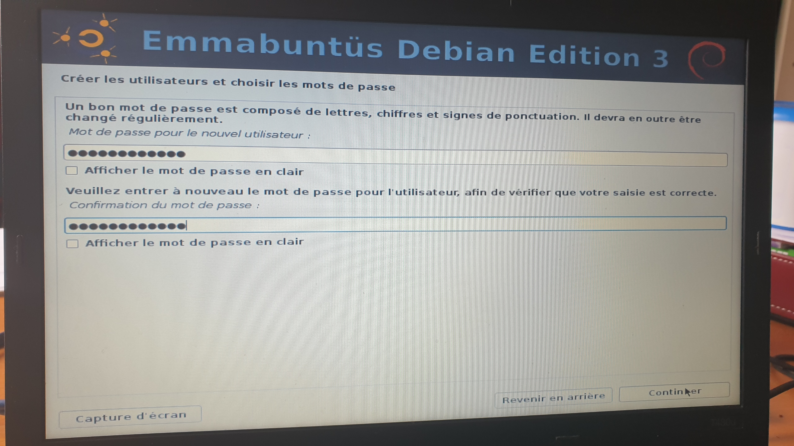</td></tr>
   <tr><td align="center">Fill the password of the GiveIT user (Twice!)</tr>
</table>
# Soft disk {style="background: #DBCEDB; text-align:center;"}
<!-- ---------------PAGE 16------------------------------------- -->
 
<table border="0" cellspacing="0" cellpadding="4" align="center" width="90%">
   <tr><td align="center">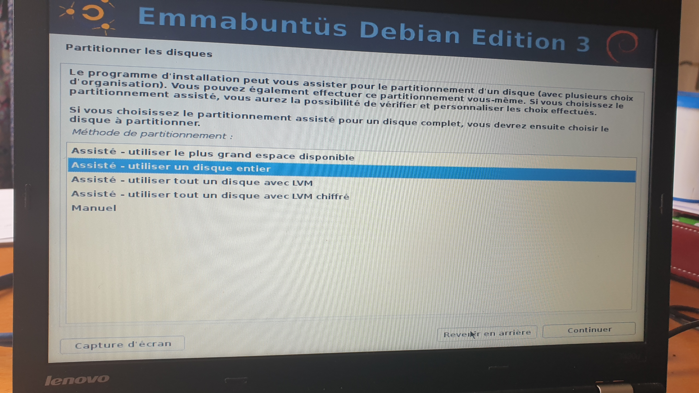</td></tr>
   <tr><td align="center">Configure the Hard Drive –> Assisted Use the full disk</tr>
</table>
# Soft disk {style="background: #DBCEDC; text-align:center;"}
<!-- ---------------PAGE 17------------------------------------- -->
 
<table border="0" cellspacing="0" cellpadding="4" align="center" width="90%">
   <tr><td align="center">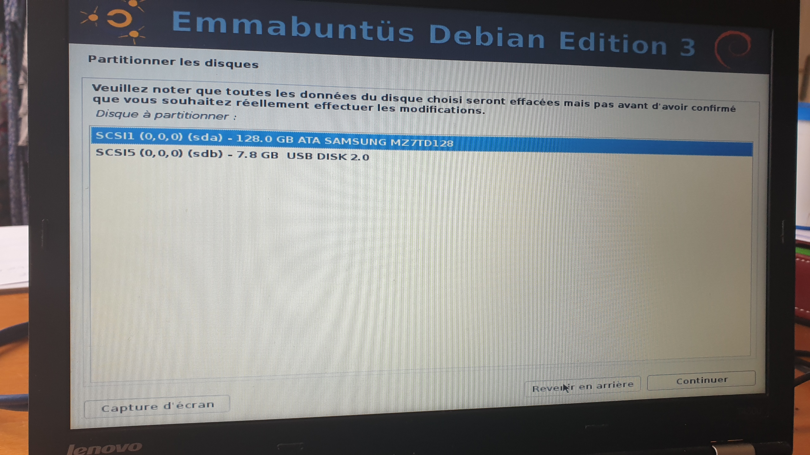</td></tr>
   <tr><td align="center">Choose SCSI1 (sda)</tr>
</table>
# Soft disk {style="background: #DBCEDD; text-align:center;"}
<!-- ---------------PAGE 18------------------------------------- -->
 
<table border="0" cellspacing="0" cellpadding="4" align="center" width="90%">
   <tr><td align="center">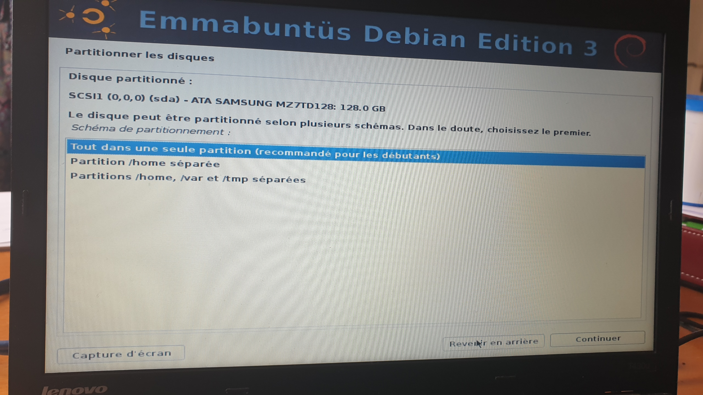</td></tr>
   <tr><td align="center">All in the same partition</tr>
</table>
# Soft disk {style="background: #DBCEDE; text-align:center;"}
<!-- ---------------PAGE 19------------------------------------- -->
 
<table border="0" cellspacing="0" cellpadding="4" align="center" width="90%">
   <tr><td align="center">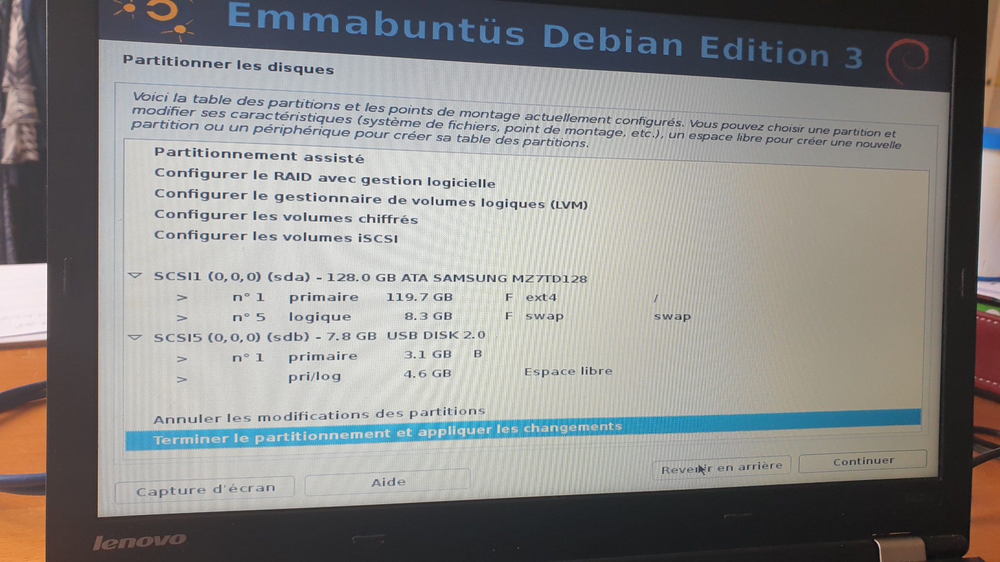</td></tr>
   <tr><td align="center">Done ! Apply the change</tr>
</table>
# Soft disk {style="background: #DBCEDF; text-align:center;"}
<!-- ---------------PAGE 20------------------------------------- -->
 
<table border="0" cellspacing="0" cellpadding="4" align="center" width="90%">
   <tr><td align="center">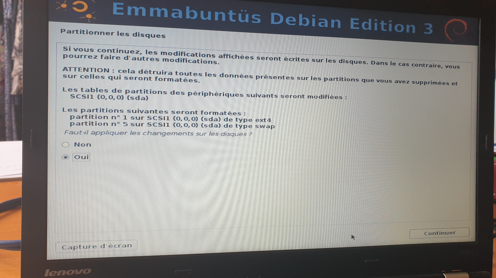</td></tr>
   <tr><td align="center">Apply the change ? YES !</tr>
</table>
# Package installation {style="background: #DBCEE0; text-align:center;"}
<!-- ---------------PAGE 21------------------------------------- -->
 
<table border="0" cellspacing="0" cellpadding="4" align="center" width="90%">
   <tr><td align="center">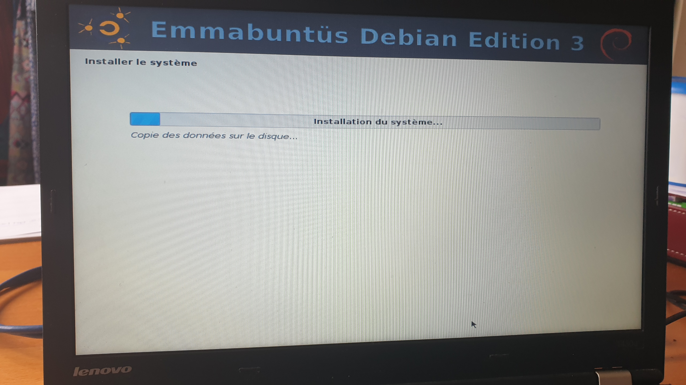</td></tr>
   <tr><td align="center">Copy packages on the disk</tr>
</table>
# Package installation {style="background: #DBCEE1; text-align:center;"}
<!-- ---------------PAGE 22------------------------------------- -->
 
<table border="0" cellspacing="0" cellpadding="4" align="center" width="90%">
   <tr><td align="center">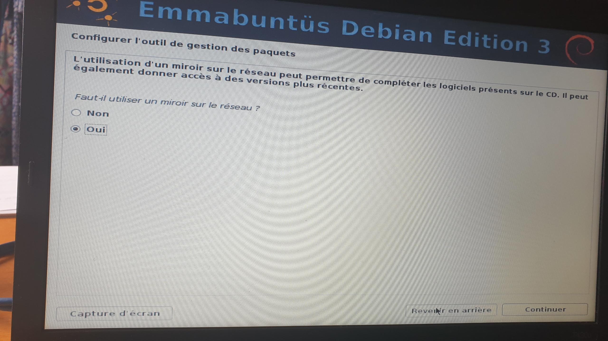</td></tr>
   <tr><td align="center">Use a mirror for updating packages ? Yes use one !</tr>
</table>
# Package installation {style="background: #DBCEE2; text-align:center;"}
<!-- ---------------PAGE 23------------------------------------- -->
 
<table border="0" cellspacing="0" cellpadding="4" align="center" width="90%">
   <tr><td align="center"></td></tr>
   <tr><td align="center">Yes, we’ll start a laptop with a boot menu called GRUB ...</tr>
</table>
# Package installation {style="background: #DBCEE3; text-align:center;"}
<!-- ---------------PAGE 24------------------------------------- -->
 
<table border="0" cellspacing="0" cellpadding="4" align="center" width="90%">
   <tr><td align="center">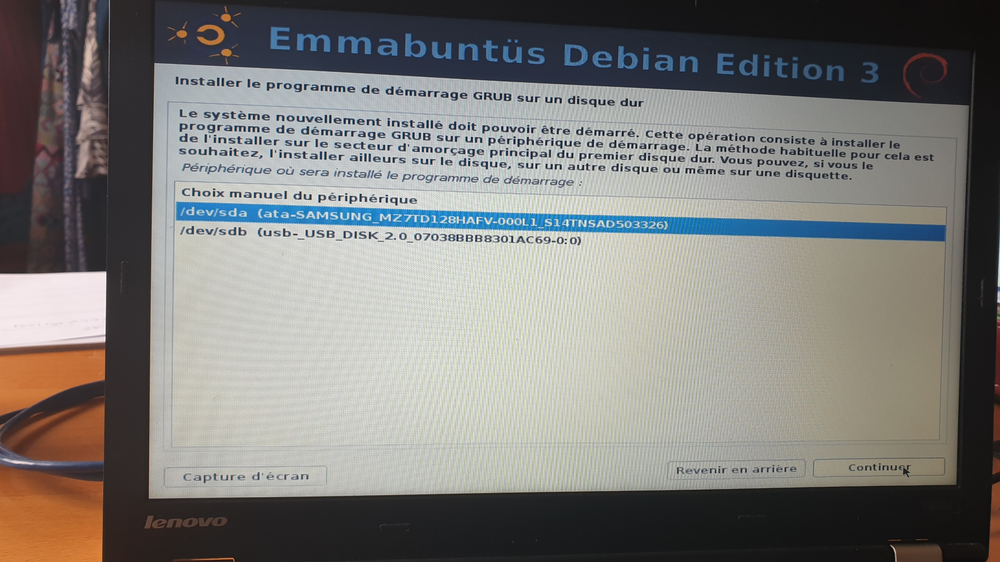</td></tr>
   <tr><td align="center">... and we are setting up on the hard drive (/dev/sda)</tr>
</table>
# Package installation {style="background: #DBCEE4; text-align:center;"}
<!-- ---------------PAGE 25------------------------------------- -->
 
<table border="0" cellspacing="0" cellpadding="4" align="center" width="90%">
   <tr><td align="center">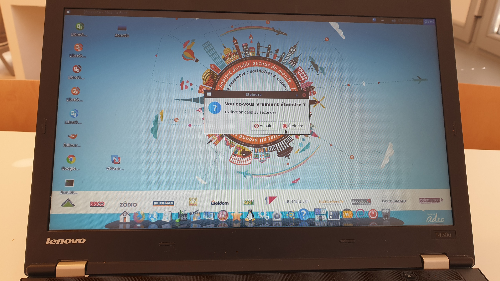</td></tr>
   <tr><td align="center">Installation done, let’s continue and reboot laptop ...</tr>
</table>
# Re-Start {style="background: #DBCEE5; text-align:center;"}
<!-- ---------------PAGE 26------------------------------------- -->
 
<table border="0" cellspacing="0" cellpadding="4" align="center" width="90%">
   <tr><td align="center">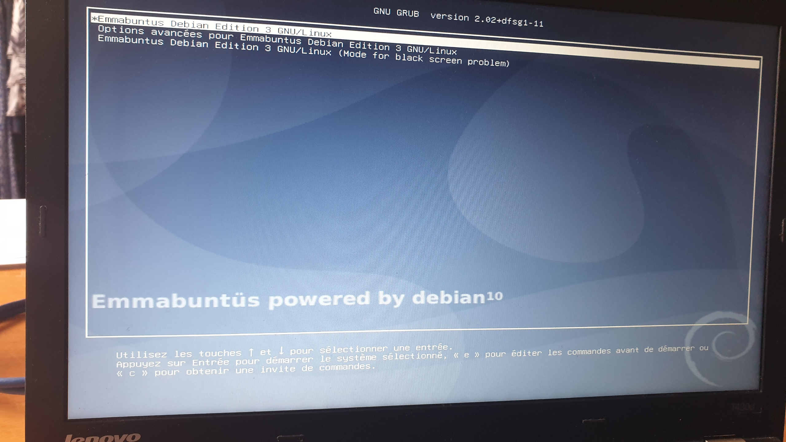</td></tr>
   <tr><td align="center">Choose first Menu option (Emmabuntus Debian Edition 3 GNU/Linux)</tr>
</table>
# First launch {style="background: #DBCEE6; text-align:center;"}
<!-- ---------------PAGE 27------------------------------------- -->
 
<table border="0" cellspacing="0" cellpadding="4" align="center" width="90%">
   <tr><td align="center">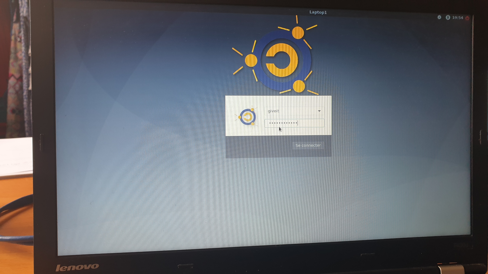</td></tr>
   <tr><td align="center">Type the password of GiveIT user</tr>
</table>
# First launch {style="background: #DBCEE7; text-align:center;"}
<!-- ---------------PAGE 28------------------------------------- -->
 
<table border="0" cellspacing="0" cellpadding="4" align="center" width="90%">
   <tr><td align="center">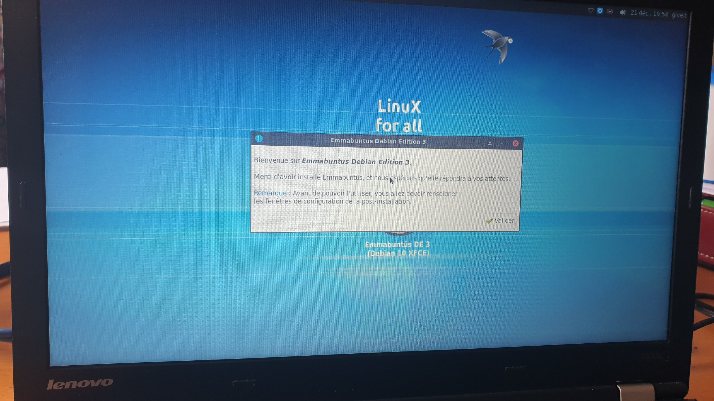</td></tr>
   <tr><td align="center">Accept the Welcome message</tr>
</table>
# Configure the Desktop {style="background: #DBCEE8; text-align:center;"}
<!-- ---------------PAGE 29------------------------------------- -->
 
<table border="0" cellspacing="0" cellpadding="4" align="center" width="90%">
   <tr><td align="center">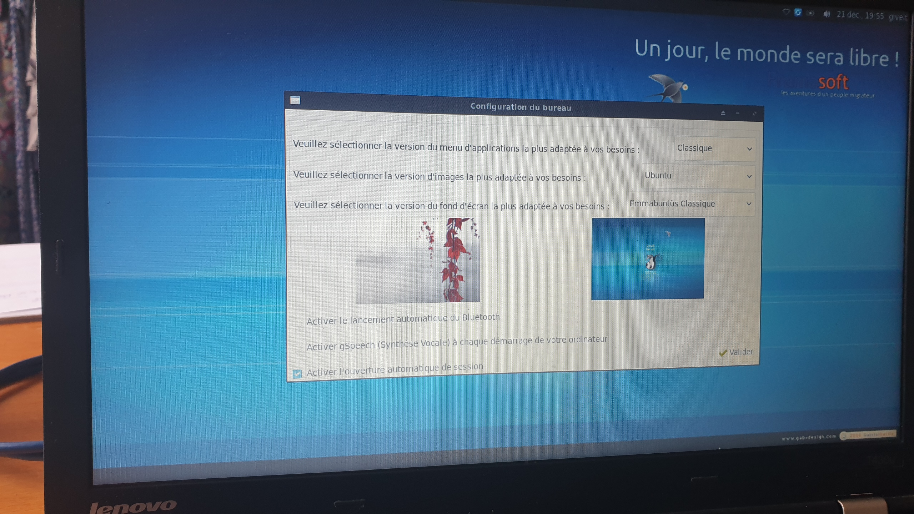</td></tr>
   <tr><td align="center">Choose the classical version (do as the screenshot)</tr>
</table>
# Configure the Desktop {style="background: #DBCEE9; text-align:center;"}
<!-- ---------------PAGE 30------------------------------------- -->
 
<table border="0" cellspacing="0" cellpadding="4" align="center" width="90%">
   <tr><td align="center">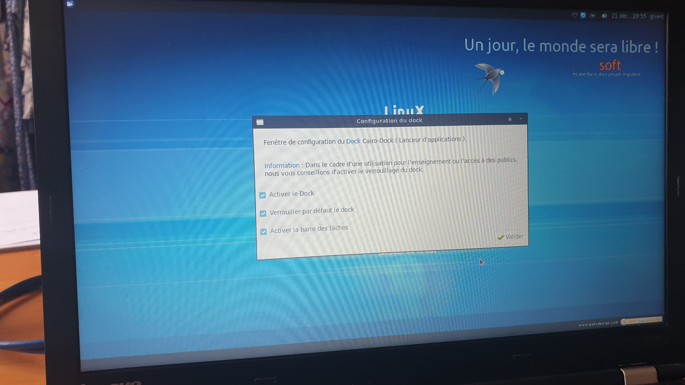</td></tr>
   <tr><td align="center">What about the Cairo Dock as on Mac OS ? (do as the screenshot)</tr>
</table>
# Configure the Desktop {style="background: #DBCEEA; text-align:center;"}
<!-- ---------------PAGE 31------------------------------------- -->
 
<table border="0" cellspacing="0" cellpadding="4" align="center" width="90%">
   <tr><td align="center"></td></tr>
   <tr><td align="center">Select a Simple Cairo Dock</tr>
</table>
# Configure the Desktop {style="background: #DBCEEB; text-align:center;"}
<!-- ---------------PAGE 32------------------------------------- -->
 
<table border="0" cellspacing="0" cellpadding="4" align="center" width="90%">
   <tr><td align="center">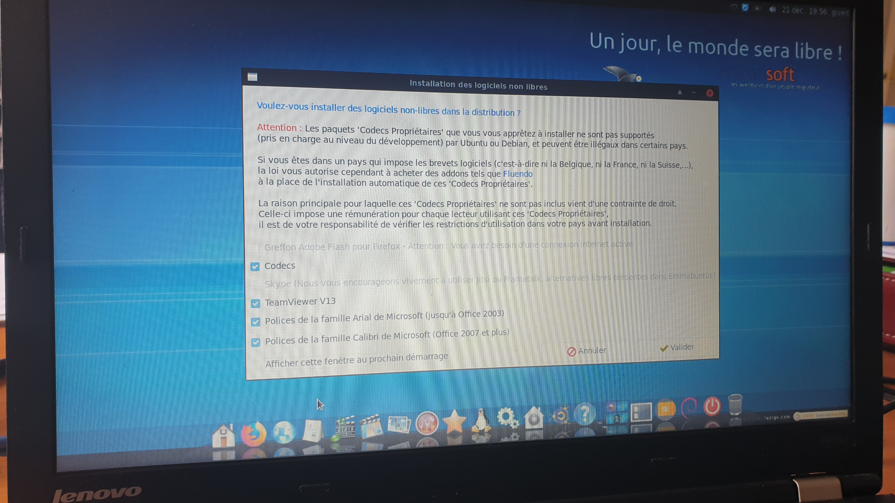</td></tr>
   <tr><td align="center">Select non Free Software (do as the screenshot)</tr>
</table>
# Configure the Desktop {style="background: #DBCEEC; text-align:center;"}
<!-- ---------------PAGE 33------------------------------------- -->
 
<table border="0" cellspacing="0" cellpadding="4" align="center" width="90%">
   <tr><td align="center">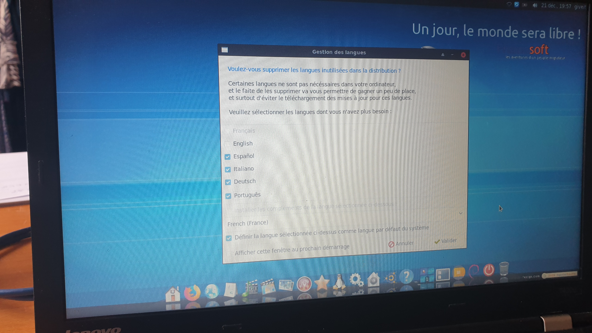</td></tr>
   <tr><td align="center">Delete some useless languages (do as the screenshot)</tr>
</table>
# Configure the Desktop {style="background: #DBCEED; text-align:center;"}
<!-- ---------------PAGE 34------------------------------------- -->
 
<table border="0" cellspacing="0" cellpadding="4" align="center" width="90%">
   <tr><td align="center">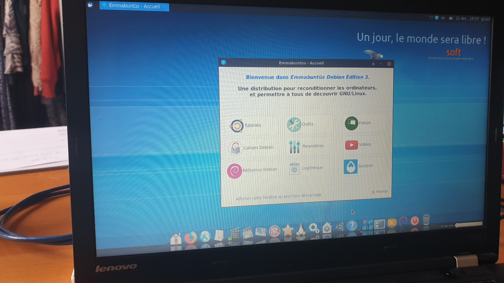</td></tr>
   <tr><td align="center">Cool ... main installation is done ! Welcome EmmaBuntüs 3 !</tr>
</table>
# Configure the Desktop {style="background: #DBCEEE; text-align:center;"}
<!-- ---------------PAGE 35------------------------------------- -->
 
<table border="0" cellspacing="0" cellpadding="4" align="center" width="90%">
   <tr><td align="center">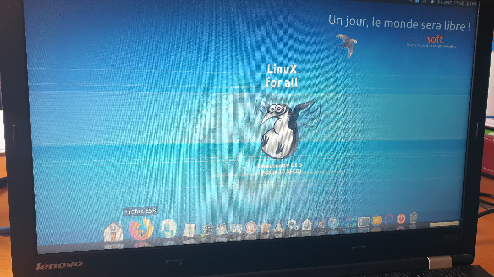</td></tr>
   <tr><td align="center">Here is the background of EmmaBuntüs</tr>
</table>
# Connexion To Internet {style="background: #DBCEEF; text-align:center;"}
<!-- ---------------PAGE 36------------------------------------- -->
 
<table border="0" cellspacing="0" cellpadding="4" align="center" width="90%">
   <tr><td align="center">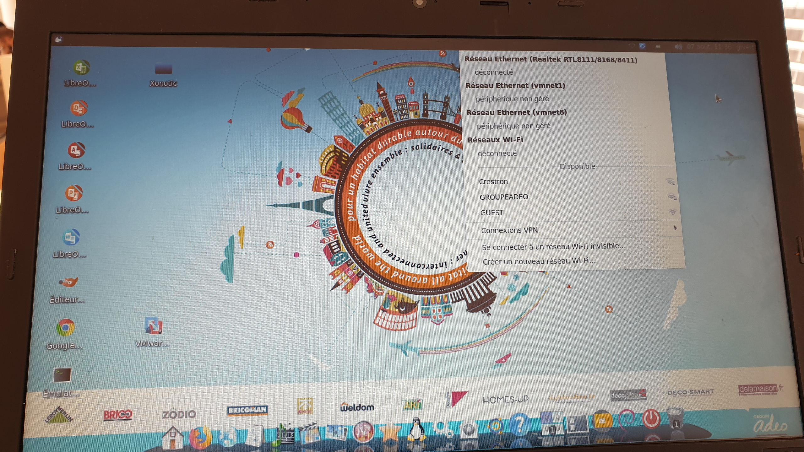</td></tr>
   <tr><td align="center">In the Upper right corner, identify the Network GUEST</tr>
</table>
# Connection To Internet {style="background: #DBCEF0; text-align:center;"}
<!-- ---------------PAGE 37------------------------------------- -->
 
<table border="0" cellspacing="0" cellpadding="4" align="center" width="90%">
   <tr><td align="center">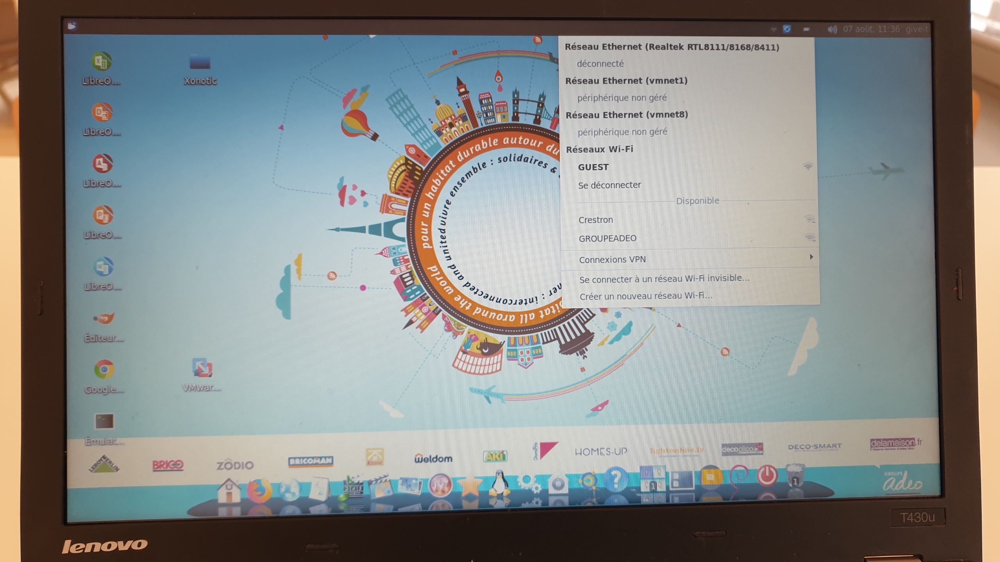</td></tr>
   <tr><td align="center">Connect to it</tr>
</table>
# Connection To Internet {style="background: #DBCEF1; text-align:center;"}
<!-- ---------------PAGE 38------------------------------------- -->
 
<table border="0" cellspacing="0" cellpadding="4" align="center" width="90%">
   <tr><td align="center">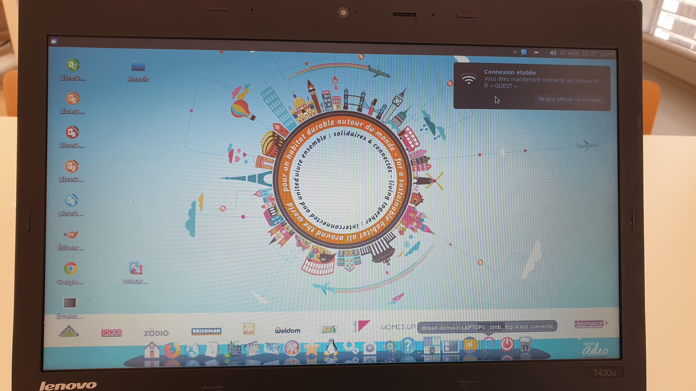</td></tr>
   <tr><td align="center">Connected !</tr>
</table>
# Connection To Internet {style="background: #DBCEF2; text-align:center;"}
<!-- ---------------PAGE 39------------------------------------- -->
 
<table border="0" cellspacing="0" cellpadding="4" align="center" width="90%">
   <tr><td align="center">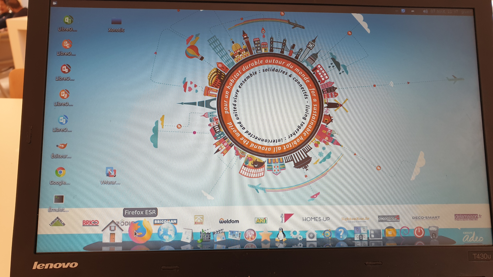</td></tr>
   <tr><td align="center">Open Firefox</tr>
</table>
# Connection To Internet {style="background: #DBCEF3; text-align:center;"}
<!-- ---------------PAGE 40------------------------------------- -->
 
<table border="0" cellspacing="0" cellpadding="4" align="center" width="90%">
   <tr><td align="center">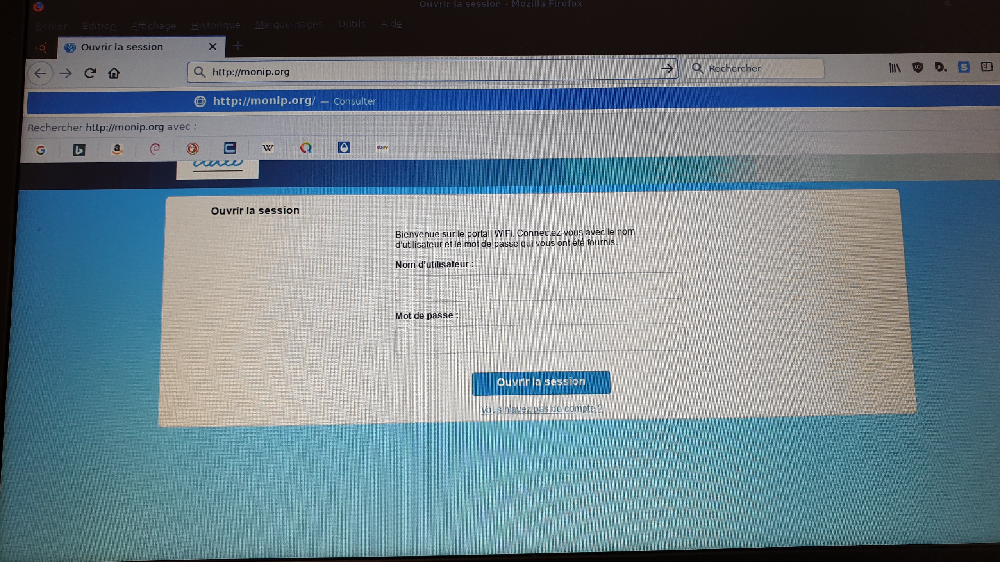</td></tr>
   <tr><td align="center">The captive portal is openning, create an account</tr>
</table>
# Connection To Internet {style="background: #DBCEF4; text-align:center;"}
<!-- ---------------PAGE 41------------------------------------- -->
 
<table border="0" cellspacing="0" cellpadding="4" align="center" width="90%">
   <tr><td align="center">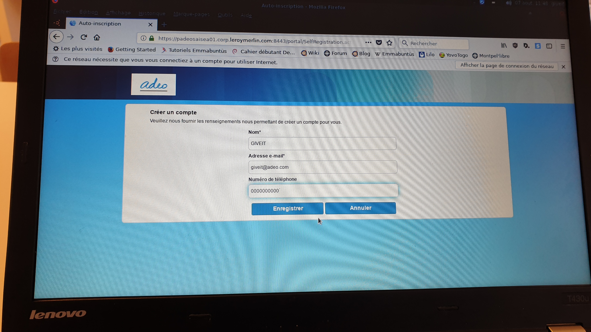</td></tr>
   <tr><td align="center">Type user info as on the copy screen / Record it</tr>
</table>
# Connection To Internet {style="background: #DBCEF5; text-align:center;"}
<!-- ---------------PAGE 42------------------------------------- -->
 
<table border="0" cellspacing="0" cellpadding="4" align="center" width="90%">
   <tr><td align="center">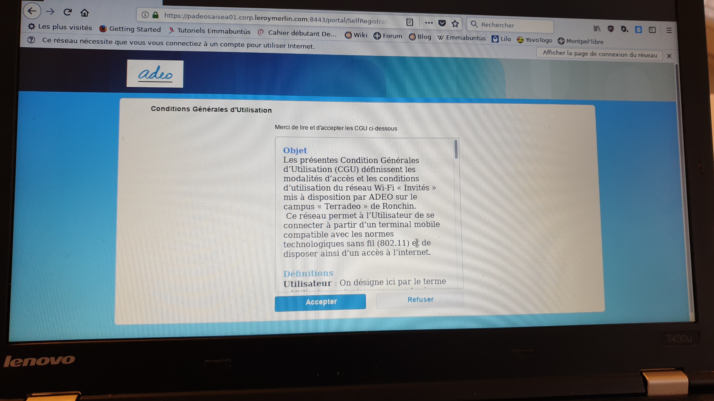</td></tr>
   <tr><td align="center">Accept the CGU !</tr>
</table>
# Connection To Internet {style="background: #DBCEF6; text-align:center;"}
<!-- ---------------PAGE 43------------------------------------- -->
 
<table border="0" cellspacing="0" cellpadding="4" align="center" width="90%">
   <tr><td align="center">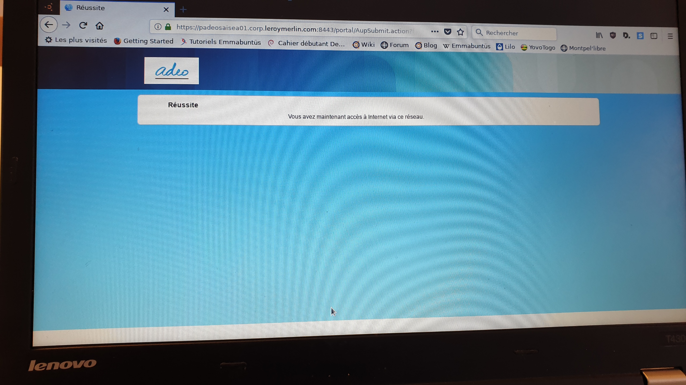</td></tr>
   <tr><td align="center">Welcome Internet !</tr>
</table>
# Configure the Lilo Engine {style="background: #DBCEF7; text-align:center;"}
<!-- ---------------PAGE 44------------------------------------- -->
 
<table border="0" cellspacing="0" cellpadding="4" align="center" width="90%">
   <tr><td align="center"></td></tr>
   <tr><td align="center">Open Firefox ESR</tr>
</table>
# Configure the Lilo Engine {style="background: #DBCEF8; text-align:center;"}
<!-- ---------------PAGE 45------------------------------------- -->
 
<table border="0" cellspacing="0" cellpadding="4" align="center" width="90%">
   <tr><td align="center">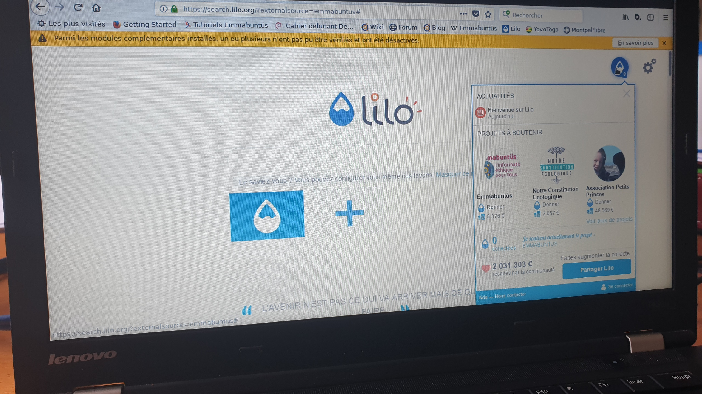</td></tr>
   <tr><td align="center">Click on the Lilo drop on the page and click on « je soutiens actuellement le projet EMMABUNTÜS »</tr>
</table>
# Configure the Lilo Engine {style="background: #DBCEF9; text-align:center;"}
<!-- ---------------PAGE 46------------------------------------- -->
 
<table border="0" cellspacing="0" cellpadding="4" align="center" width="90%">
   <tr><td align="center">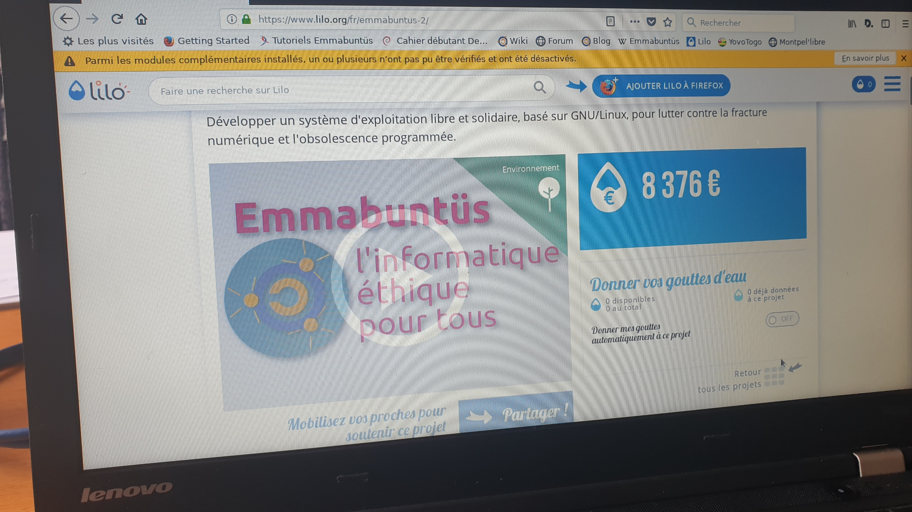</td></tr>
   <tr><td align="center">Switch ON on OFF</tr>
</table>
# Configure the Lilo Engine {style="background: #DBCEFA; text-align:center;"}
<!-- ---------------PAGE 47------------------------------------- -->
 
<table border="0" cellspacing="0" cellpadding="4" align="center" width="90%">
   <tr><td align="center">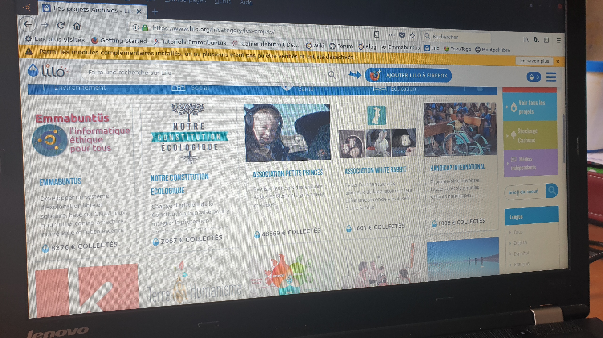</td></tr>
   <tr><td align="center">Search a new project : Brico du coeur</tr>
</table>
# Configure the Lilo Engine {style="background: #DBCEFB; text-align:center;"}
<!-- ---------------PAGE 48------------------------------------- -->
 
<table border="0" cellspacing="0" cellpadding="4" align="center" width="90%">
   <tr><td align="center">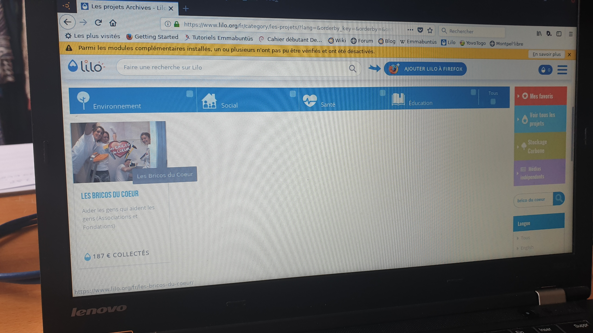</td></tr>
   <tr><td align="center">Here it is Brico du coeur</tr>
</table>
# Configure the Lilo Engine {style="background: #DBCEFC; text-align:center;"}
<!-- ---------------PAGE 49------------------------------------- -->
 
<table border="0" cellspacing="0" cellpadding="4" align="center" width="90%">
   <tr><td align="center">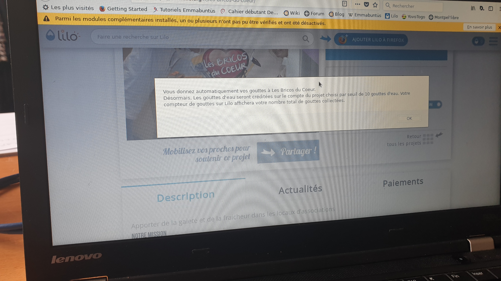</td></tr>
   <tr><td align="center">Give the drop to the project</tr>
</table>
# Shortcuts {style="background: #DBCEFD; text-align:center;"}
<!-- ---------------PAGE 50------------------------------------- -->
 
<table border="0" cellspacing="0" cellpadding="4" align="center" width="90%">
   <tr><td align="center">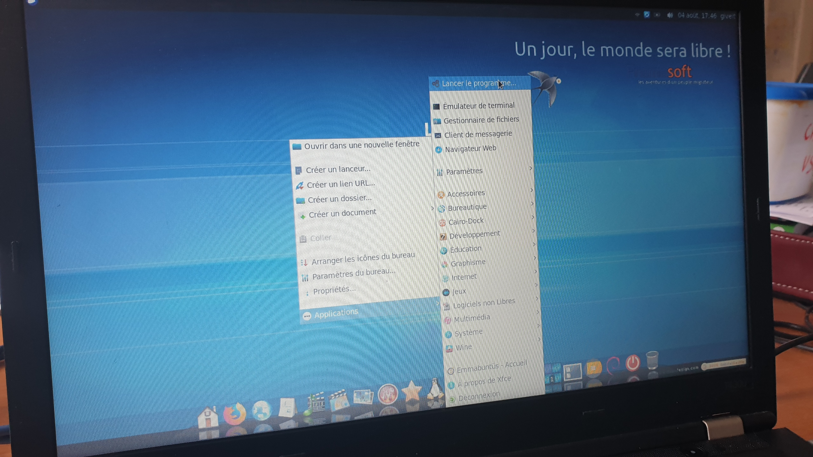</td></tr>
   <tr><td align="center">Create Shortcuts : from the desktop, right click, « Lancer le programme... »</tr>
</table>
# Shortcuts {style="background: #DBCEFE; text-align:center;"}
<!-- ---------------PAGE 51------------------------------------- -->
 
<table border="0" cellspacing="0" cellpadding="4" align="center" width="90%">
   <tr><td align="center">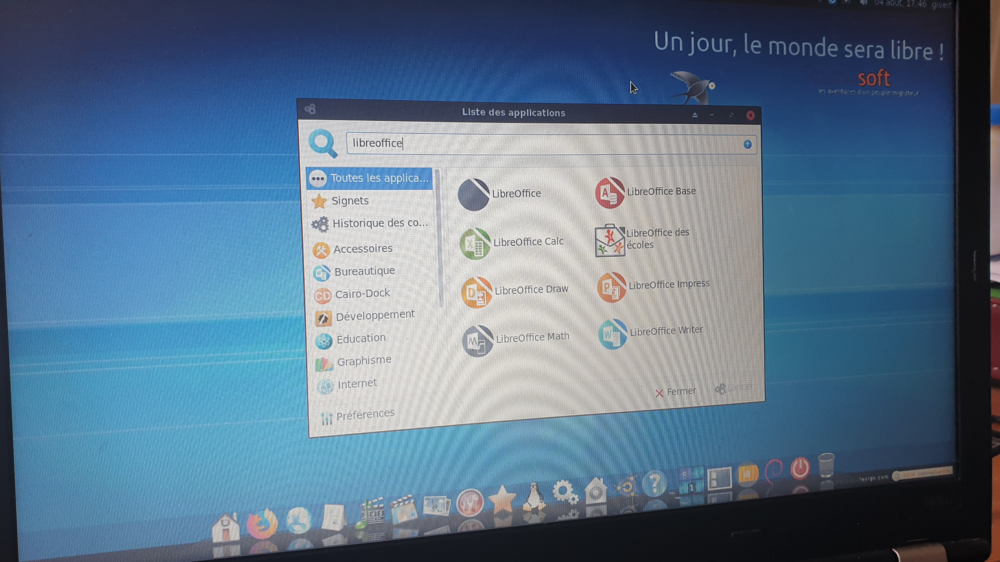</td></tr>
   <tr><td align="center">Type Libreoffice it's a software like Word/Excel. We have to slide icons Calc - Impress - Writer on the desktop</tr>
</table>
# Shortcuts {style="background: #DBCEFF; text-align:center;"}
<!-- ---------------PAGE 52------------------------------------- -->
 
<table border="0" cellspacing="0" cellpadding="4" align="center" width="90%">
   <tr><td align="center">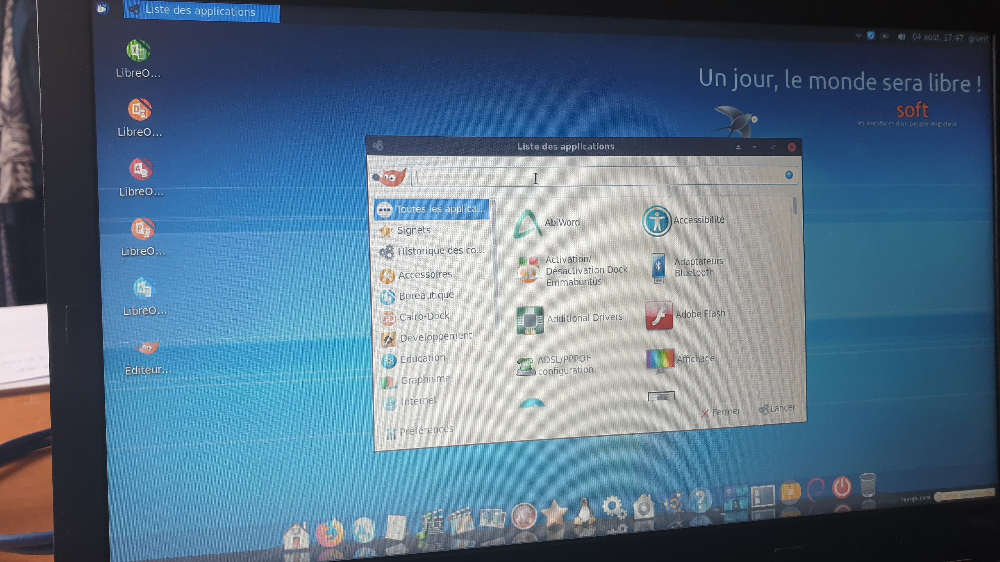</td></tr>
   <tr><td align="center">Do the same with Gimp (Image Tool)</tr>
</table>
# Shortcuts {style="background: #DBCF00; text-align:center;"}
<!-- ---------------PAGE 53------------------------------------- -->
 
<table border="0" cellspacing="0" cellpadding="4" align="center" width="90%">
   <tr><td align="center">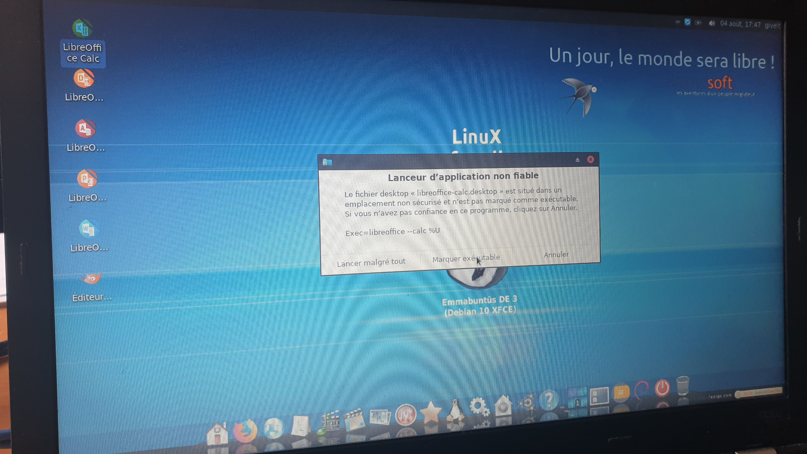</td></tr>
   <tr><td align="center">Click on each icôn for testing .. Well Software is not reliable so mark it as Executable</tr>
</table>
# Shortcuts {style="background: #DBCF01; text-align:center;"}
<!-- ---------------PAGE 54------------------------------------- -->
 
<table border="0" cellspacing="0" cellpadding="4" align="center" width="90%">
   <tr><td align="center"></td></tr>
   <tr><td align="center">Well Office Spreadsheet is OK</tr>
</table>
# Shortcuts {style="background: #DBCF02; text-align:center;"}
<!-- ---------------PAGE 55------------------------------------- -->
 
<table border="0" cellspacing="0" cellpadding="4" align="center" width="90%">
   <tr><td align="center">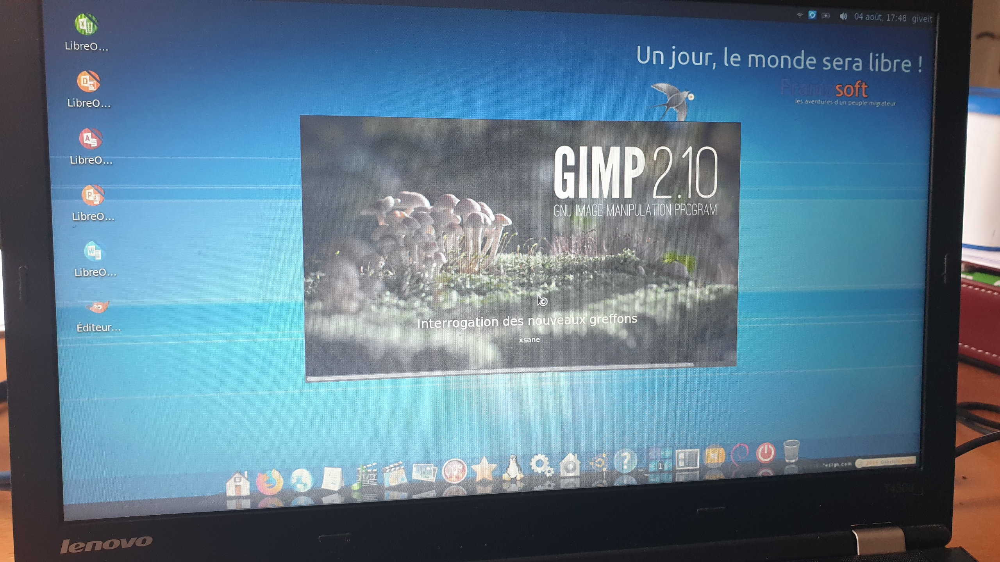</td></tr>
   <tr><td align="center">Well the Gimp is OK</tr>
</table>
# Laptop branded Brico du Coeur {style="background: #DBCF03; text-align:center;"}
<!-- ---------------PAGE 56------------------------------------- -->
 
<table border="0" cellspacing="0" cellpadding="4" align="center" width="90%">
   <tr><td align="center">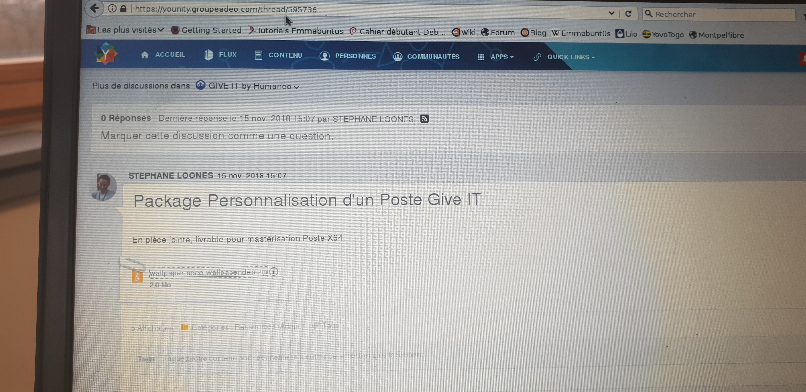</td></tr>
   <tr><td align="center">Get the package for the background. Connect to https://younity.groupeadeo.com/thread/595736 , ! DON'T SAVE YOUR PASSWORD !</tr>
</table>
# Laptop branded Brico du Coeur {style="background: #DBCF04; text-align:center;"}
<!-- ---------------PAGE 57------------------------------------- -->
 
<table border="0" cellspacing="0" cellpadding="4" align="center" width="90%">
   <tr><td align="center"></td></tr>
   <tr><td align="center">Get the linked document / Open with Archive manager</tr>
</table>
# Laptop branded Brico du Coeur {style="background: #DBCF05; text-align:center;"}
<!-- ---------------PAGE 58------------------------------------- -->
 
<table border="0" cellspacing="0" cellpadding="4" align="center" width="90%">
   <tr><td align="center">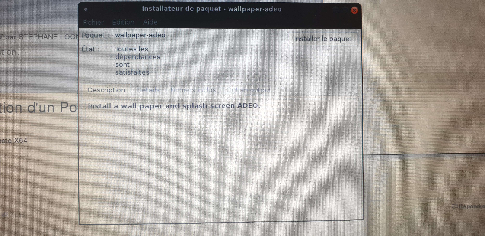</td></tr>
   <tr><td align="center">As told Bigard : we install the paquet</tr>
</table>
# Laptop branded Brico du Coeur {style="background: #DBCF06; text-align:center;"}
<!-- ---------------PAGE 59------------------------------------- -->
 
<table border="0" cellspacing="0" cellpadding="4" align="center" width="90%">
   <tr><td align="center">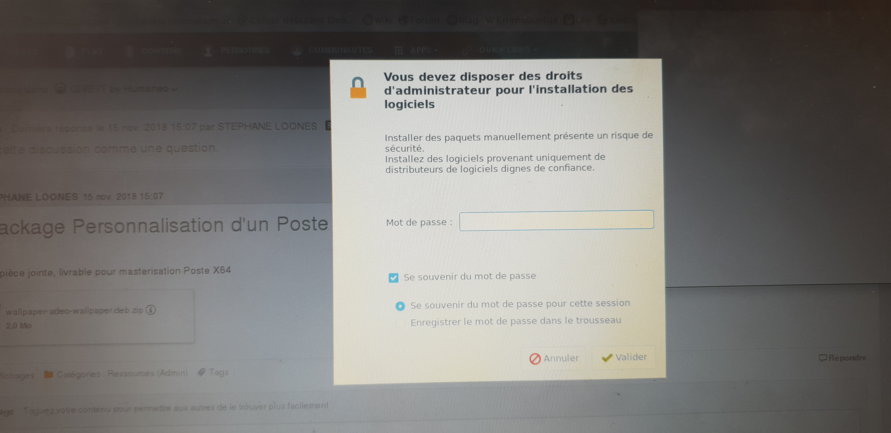</td></tr>
   <tr><td align="center">Fill with the admin password</tr>
</table>
# Laptop branded Brico du Coeur {style="background: #DBCF07; text-align:center;"}
<!-- ---------------PAGE 60------------------------------------- -->
 
<table border="0" cellspacing="0" cellpadding="4" align="center" width="90%">
   <tr><td align="center">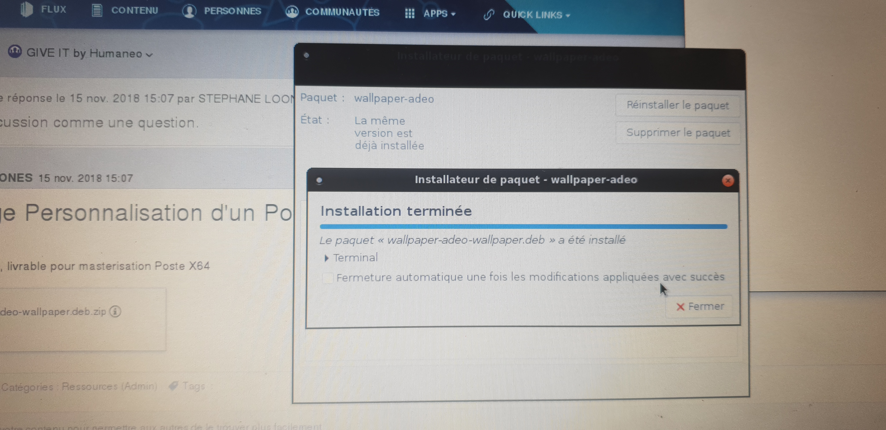</td></tr>
   <tr><td align="center">Paquet installed</tr>
</table>
# Laptop branded Brico du Coeur {style="background: #DBCF08; text-align:center;"}
<!-- ---------------PAGE 61------------------------------------- -->
 
<table border="0" cellspacing="0" cellpadding="4" align="center" width="90%">
   <tr><td align="center"></td></tr>
   <tr><td align="center">Restart the Laptop</tr>
</table>
# This is the end {style="background: #DBCF09; text-align:center;"}
<!-- ---------------PAGE 62------------------------------------- -->
 
<table border="0" cellspacing="0" cellpadding="4" align="center" width="90%">
   <tr><td align="center">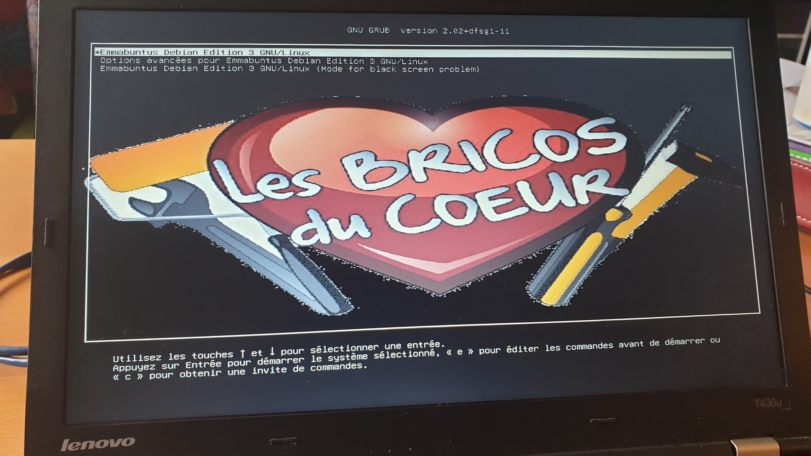</td></tr>
   <tr><td align="center">Well see the Splash Screen Bricos du Coeur</tr>
</table>
# This is the end {style="background: #DBCF0A; text-align:center;"}
<!-- ---------------PAGE 63------------------------------------- -->
 
<table border="0" cellspacing="0" cellpadding="4" align="center" width="90%">
   <tr><td align="center">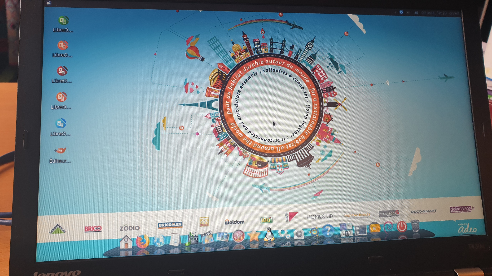</td></tr>
   <tr><td align="center">ALL RIGHT GUY</tr>
</table>
# This is the end !!! THANKS !!! {style="background: #DBCF0B; text-align:center;"}
<!-- ---------------PAGE 64------------------------------------- -->
 
<table border="0" cellspacing="0" cellpadding="4" align="center" width="90%">
   <tr><td align="center"></td></tr>
   <tr><td align="center"></tr>
</table>
# Install Updates (Optional) {style="background: #DBCF0C; text-align:center;"}
<!-- ---------------PAGE 65------------------------------------- -->
 
<table border="0" cellspacing="0" cellpadding="4" align="center" width="90%">
   <tr><td align="center">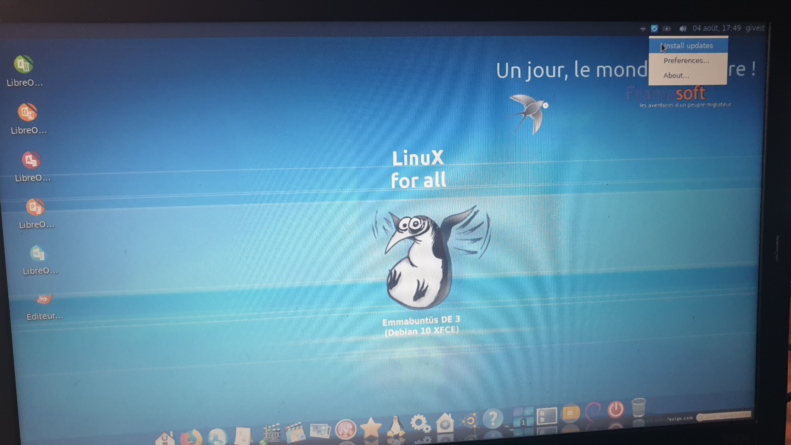</td></tr>
   <tr><td align="center">Click on the circle Icon in the task bar</tr>
</table>
# Install Updates (Optional) {style="background: #DBCF0D; text-align:center;"}
<!-- ---------------PAGE 66------------------------------------- -->
 
<table border="0" cellspacing="0" cellpadding="4" align="center" width="90%">
   <tr><td align="center">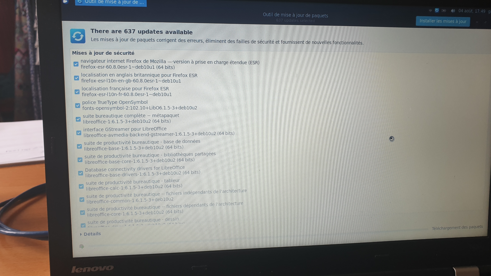</td></tr>
   <tr><td align="center">Clic on « Installer les mises à jour »</tr>
</table>
# Install Updates (Optional) {style="background: #DBCF0E; text-align:center;"}
<!-- ---------------PAGE 67------------------------------------- -->
 
<table border="0" cellspacing="0" cellpadding="4" align="center" width="90%">
   <tr><td align="center">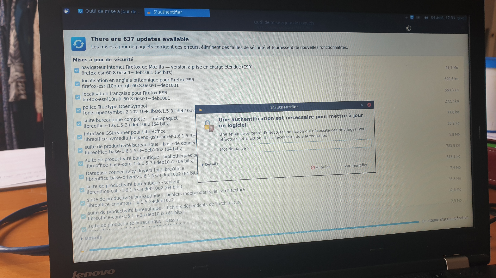</td></tr>
   <tr><td align="center">The admin password will be asked, let's wait 30 minutes par updating everything o_O</tr>
</table>
#  {style="background: #DBCF0F; text-align:center;"}
<!-- ---------------PAGE 68------------------------------------- -->
 
<table border="0" cellspacing="0" cellpadding="4" align="center" width="90%">
   <tr><td align="center"></td></tr>
   <tr><td align="center"></tr>
</table>
