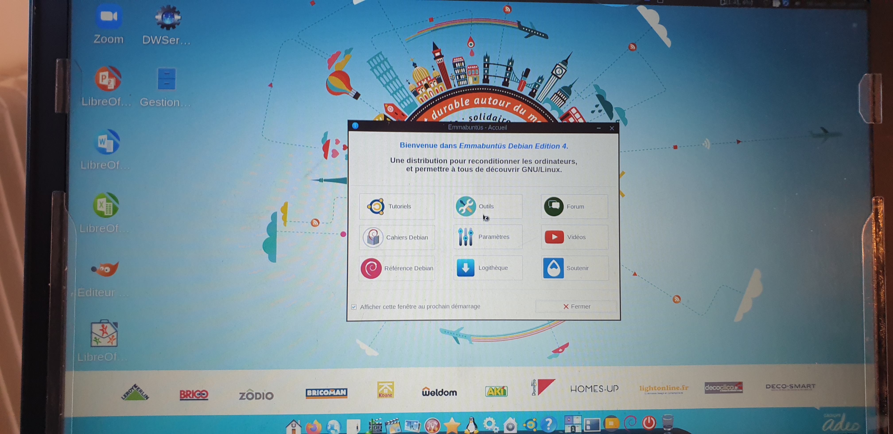

% Installation Guide
% Team Give IT / Mon 13 2021
% Well, installation will be done in 7mn without a mouse, YES!
 
# Laptop must be blank
{ width=250px }
 
# Laptop must be blank
"){ width=250px }
 
# Laptop must be blank
{ width=250px }
 
# Laptop must be blank
{ width=250px }
 
# Laptop must be blank
. Enter the code for authorizing the change"){ width=250px }
 
# Change Language
{ width=250px }
 
# Change Language
"){ width=250px }
 
# Change Language
{ width=250px }
 
# Change Language
{ width=250px }
 
# Change Language
{ width=250px }
 
# Start the installation
{ width=250px }
 
# Start the installation
. Press Enter"){ width=250px }
 
# Start the installation
{ width=250px }
 
# Start the installation
{ width=250px }
 
# Start the installation
"){ width=250px }
 
# Installation done
{ width=250px }
 
# This is the end !!! THANKS !!!
{ width=250px }
 
